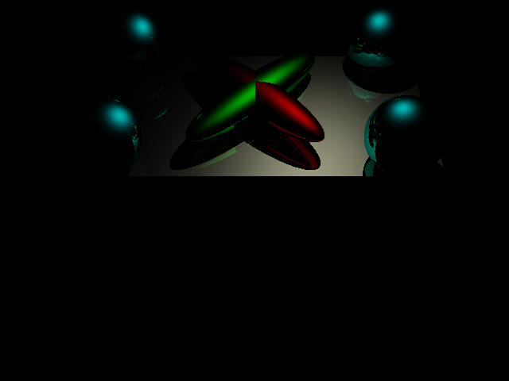
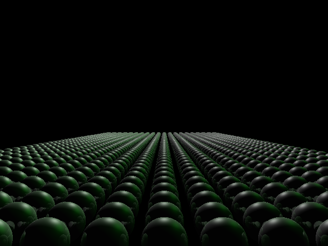
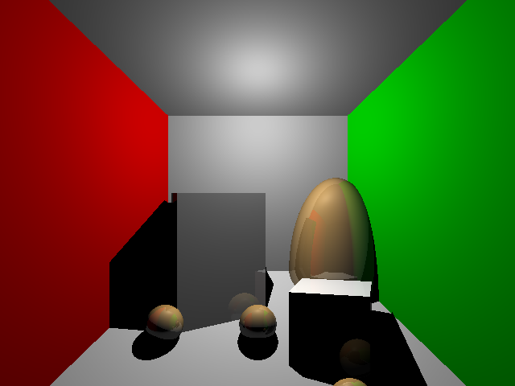
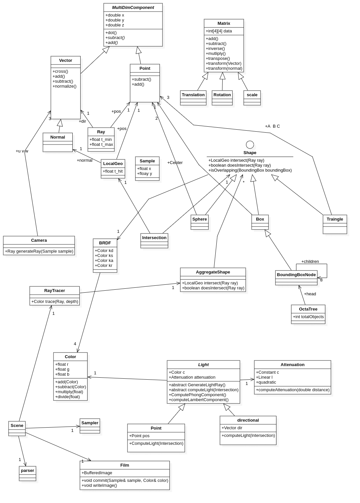

<h1>Cranberry Ray Tracer</h1>

[](https://www.firsttimersonly.com/)
[](https://gitter.im/CraberryRayTracer/community?utm_source=badge&utm_medium=badge&utm_campaign=pr-badge)

A Ray Tracer engine that can render different scenes with interesting effects.

## Features

1. Custom Scene rendering
2. Support for sphere primitive.
3. support for triangle primitive.
4. Support for Lambert and Phone shadings.
5. Support for shadows.
6. Support for reflections.

# Getting Started

Cranberry Ray tracer is built as a jar executable. Thus it can be executed directly from any directory without installation.
Following is the instructions for running the program.

## Prerequisites

The only thing you need to have installed in order to run this program is:

- java SE 8 runtime environment

## Running

1. Press on the releases button on the github page of this project.
2. Download the .jar binary for the project.
5. Open up the terminal and cd to the directory where CranberryRayTracer.jar was downloaded.
6. Run the following command

`java -jar CranberryRayTracer.jar -i path/to/inputfile.cbg`

where path/to/inputfile.cbg is the path to the cbg file that has the info about the scene. More on that in the next section

# Input file (.cbg)

The cbg file is a file that contains information about the scene such as the camera, lights and the objects in the scene.
The input cbg text file consists of a sequence of lines, each of which has a command. The commands are parsed by cranberry ray tracer
and the scene is rendered according to the description of this file.

## File specification

1. \# comments This is a line of comments. Ignore any line starting with a \#.
2. Blank line The input file can have blank lines that should be ignored.
3. command parameter1 parameter2 ... The first part of the line is always the command. Based on what the command is, it has certain parameters which should be parsed appropriately.

## General Commands

You should implement the following general commands:

1. size width height: The size command must be the first command of the file, which controls the image size.
2. maxdepth depth (optional): The maximum depth (number of bounces) for a ray (default should be 5).
3. output filename (optional): The output file to which the image should be written.

## Camera command

- **camera lookfromx lookfromy lookfromz lookatx lookaty lookatz upx upy upz fov** specifies the camera in the standard way

## Geometry

1. **sphere x y z radius** Defines a sphere with a given position and radius.
2. **maxverts number** Defines a maximum number of vertices for later triangle specifications. It must be set before vertices are defined.
3.**maxvertnorms number** Defines a maximum number of vertices with normals for later specifications. It must be set before vertices with normals are defined. (same discussion as above)
4. **vertex x y z** Defines a vertex at the given location. The vertex is put into a pile, starting to be numbered at 0.
5. **vertexnormal x y z nx ny nz** Similar to the above, but define a surface normal with each vertex. The vertex and vertexnormal set of vertices are completely independent (as are maxverts and maxvertnorms).
6. **tri v1 v2 v3** Create a triangle out of the vertices involved (which have previously been specified with the vertex command). The vertices are assumed to be specified in counter-clockwise order. Your code should internally compute a face normal for this triangle.
7. **trinormal v1 v2 v3** Same as above but for vertices specified with normals. In this case, each vertex has an associated normal, and when doing shading, you should interpolate the normals for intermediate points on the triangle.

## Transformations
You should be able to apply a transformation to each of the elements of geometry (and also light sources). These correspond to right-multiplying the modelview matrix in OpenGL and have exactly the same semantics, just like in assignment 2. It is up to you how exactly to implement them. At the very least, you need to keep track of the current matrix. (Presumably, you can reuse some of the same implementation you did for assignment 2). For triangles, you might simply transform them to the eye coordinates and store them there. For spheres, you could store the transformation with them, doing the trick of pre-transforming the ray, intersecting with a sphere, and then post-transforming the intersection point. The required transformations to implement are:

1. **translate x y z A** translation 3-vector.
2. **rotate x y z angle Rotate by angle (in degrees)** about the given axis as in OpenGL.
3. **scale x y z** Scale by the corresponding amount in each axis (a non-uniform scaling).
4. **pushTransform** Push the current modeling transform on the stack as in OpenGL. You might want to do pushTransform immediately after setting the camera to preserve the identity transformation.
5. **popTransform** Pop the current transform from the stack as in OpenGL. The sequence of popTransform and pushTransform can be used if desired before every primitive to reset the transformation (assuming the initial camera transformation is on the stack as discussed above).

## Lights
You should implement the following lighting commands.

1. **directional x y z r g b** The direction to the light source, and the color, as in OpenGL.
2. **point x y z r g b** The location of a point source and the color, as in OpenGL.
3. **attenuation const linear quadratic** Sets the constant, linear and quadratic attenuations (default 1,0,0) as in OpenGL. By default there is no attenuation (the constant term is 1, linear and quadratic are 0; that's what we mean by 1,0,0).
4. **ambient r g b** The global ambient color to be added for each object (default is .2,.2,.2)

## Materials
Finally, you need to implement the following material properties.

5. **diffuse r g b** specifies the diffuse color of the surface.
6. **specular r g b** specifies the specular color of the surface.
7. **shininess s** specifies the shininess of the surface.
emission r g b gives the emissive color of the surface.

## File structure

The file should always start by specifying the dimensions of the screen at the very beginning followed by the other two
general optional commands if desired. Then the file must have the camera command next. Followed by that, Geometry, Lights, Transformations
and Materials command can be specified in any desired order the file would still be parsed. However, keep in mind that the order of the
commands given matter especially when it comes to Materials and Transformations.  One a material is set, all the following objects will
take have the value of this material. Once it is changed the following objects defined will have the new value while the already defined
objects will still have their old value. Likewise the order of transformations matters. Unless the push and pop commands are used, a
defined transformation will apply to all the defined objects. If you want the transformation to apply only to a specific number of objects
you have to use the push command before defining any transformation and then use the pop command to stop applying this transformation.
Note that the push and pop commands can be nested as many times as you would like.

#### Example
```
# Test Scene 1
# A simple quad viewed from different camera positions

size 640 480
output scene1.png


# Now specify the camera.  This is what you should implement.
# This file has 4 camera positions.  Render your scene for all 4.

camera 0 -3 3 0 0 0 0 1 0 30


# lighting/material definitions
# for initial testing, you should get the geometry right
# you may want to use dummy (constant) shading, ignoring these lines

ambient .1 .1 .1
directional 0 0 1 .5 .5 .5
point 4 0 4 .5 .5 .5
diffuse 1 0 0
specular 0 0 0

# Now specify the geometry
# Again, for initial testing, maybe you want to implement a dummy
# ray-plane intersection routine, instead of reading this fully.
# Though it's probably simpler you just implement this, for later
# parts of the assignment.

maxverts 4

vertex -1 -1 0
vertex +1 -1 0
vertex +1 +1 0
vertex -1 +1 0

tri 0 1 2
tri 0 2 3
```
#### More examples

More examples can be found at the [scenese](scenes/) folder in the project


# Sample scenes produced by Cranberry Ray Tracer









# Documentation



Full documentation for developers and contributors can be found [here](https://abdullahemad12.github.io/CranberryRayTracerDocs/)